# Application
  Application is a set of programs to do a particular task

---

### Standalone application
  - Installation is mandatory.
  - Internet is not required.
  - Browswer is not requried/
  - Stored in own device.
  e.g. => notepad, paint, word, excel, temple run etc.
---

### Web application
  - Installation is not mandatory.
  - Internet is required.
  - Browswer is required. 
  - Stored in server.
  e.g. => facebook, instagram, whatsapp, gmail, amazon etc.
--------------------------------------------------------------------

### Client-server application/ mobile application.
  - installation is mandatory.
  - Internet is required.
  - Browswer is required.
  - Stored in server and in own device.
  e.g. => facebook, telegram, instagram, amazon, gmail, pubg etc.
---

### SQL (structured query langugage)
  - SQL is also called as <br/> 
  S - Simple               <br/> 
  E - English             <br/> 
  SQL - Querry            <br/>
  L - Language             <br/> 

### Data
  It is a raw fact which describes attributes of an entity.
  (Attributes = properties)
  (Entity = living / non-living thing / object)

### Database
  Database is a place or medium which is used to store the data in systematic and organised manner.

On database we can perform CRUD operations: 
  * Create / Insert
  * Read / Retreive
  * Update / Modifty
  * Drop / Delete
---


### (DBMS) Database Management System.
  DBMS is a software which is used to maintain and manage the database.

  * In DBMS we can store the data in file format.
  * Here we are using Querry Langugage (QL) to interact with (DBMS).
  * Security and Authorization are the important features of DBMS.

### Security: 
    No third party can acces it. 
### Authorization: 
    is giving permission and take back the given permission.   

### RDBMS (Relational DBMS).
  RDBMS is a software which is used to maintain and manage the database.
  * In RDBMS we can store the data in table form.
  * Here we are using structured query language to interact with RDBMS.
  * Security and authorization are two important features.
---

## ***02/02/2023***

### Stucture of table
  * Columns
  => The veritcal sectors in the table is known as columns.

  * Rows
  => The horizontal sectors in the table is known as rows.

  * Cell
  => The smallest unit in the table.
       or
  => The intersection of rows & columns is called as cell.

  * Table
  => The organisation of rows and columns is called as table.
  -----------------------------------------------------------------

### Relational Model
  - The data scientist called E.F.Codd invented ralational model.
  - Any DBMS software which follows relational model in it becomes RDBMS.
  - In relational model we will store everything in the form of table.
  - DBMS + RM = RDBMS

#### Rules of E.F.Codd 
  1) The data entered in the cell should be a single valued data (atomic data).
  2) In RDBMS we can store everthing in the form of tables including metadata.    
    metadata =>  the data about the data is called as metadata and it is stored in metadata table.    
    for example:  time, size, date, format of image present in table.    
    this metadata is stored in metatable.
    metadata is created by software.
  3) In RDBMS we can store the data in multiple tables if we want we can create the connection between the tables by using 
     the "Key Attributers"
  4) The data entered in the table can be validated in 2 steps:      
    1)  By assigning Datatype (mandatory).    
    2)  By assigning contraints (optional). 
     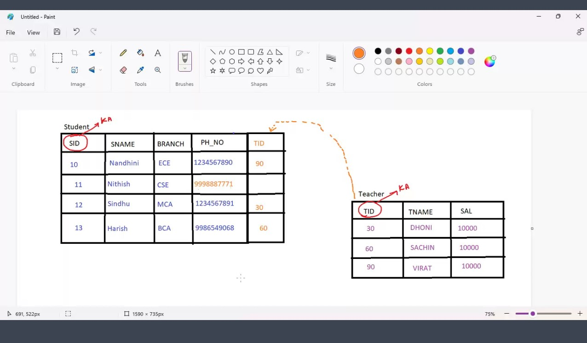
     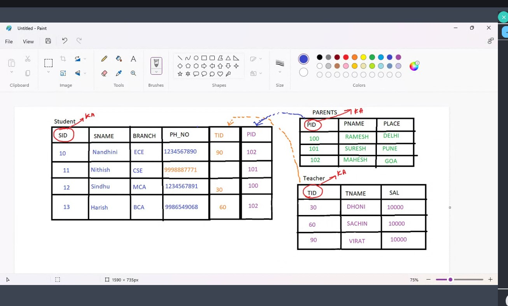
---
## ***03/02/2023***

### Data Types
#### Datatypes are used to find what kind of data is present in a particular column.

####  Types:
    1) Char datatype
    2) Varchar/Varchar2 datatype
    3) Date datatype
    4) Number datatype
    5) Large Object
       a) Character large object (LOB)
       b) Binary large object (BLOB)

####  1) Char datatype:
  - It will accept A-Z, a-z, 0-9, '!@#$%^&', '!@#abc'
  - whenever we use char datatype we want ot mention size for it.
  - we can store upto 2000 memory allocation
  - char uses "fixed length memory allocation".
  - syntax = Chhar(size)

  - it uses fixed length memory allocation. 
  - we  have to define the length first.
  - it can lead to memory wastage.
  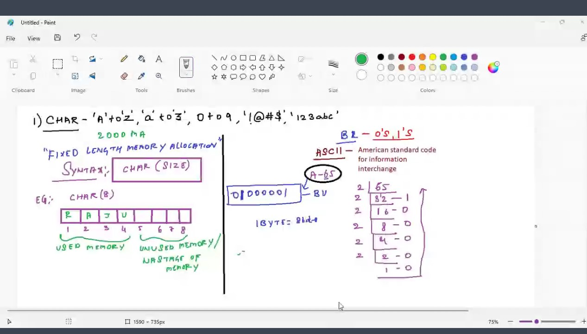

#### 2)Varchar: 
   - It will accept 'A'to 'Z', 'a' to 'z', 0 to 0, '!@#$%^&', '!@#abc'.
   - whenever we use varchar datatype we want to mention some size for it.
   - we can store upto 2000 memory allocation.
   - varchar uses "variable length memory allocation".
   - Syntax = VARCHAR(size)
   - unused memory will be used for other data,. (no memory wastage.)

#### Varchar2:
  - It is an updated version of varchar
  - we can store upto 4000 memory allocation\
  - syntax = varchar2(size)

#### 3) Date:
  - it is used to store the data in a particular date format.
  - syntax = Date

  ##### oracle date formats:
    a) DD-MON-YYYY eg.=> '10-NOV-2023'
    b) DD-MON-YY    eg.=> '10-NOV-23'

#### 4) NUMBER datatype:
   - it is used  to store numerical values.
   - syntax = Number(Precision[,scale])

   eg. 999.99    
   where 999 is precesion and .99 is scale.

   * Precision
     - Precision is nothing but interger values.
     - Precision cant be 0
     - Precision ranges from 1 to 38
     - There is no default value for precision

   * Scale
     - Scale is nothing but decimal values
     - The default value of scale is 0.
     - scale ranges from -84 to 127

## 04/02/2023
#### `5) Large Object:-`
  a) Character large object:    
    - It is used to store characters upto 4GB of size.   
    - Syntax: ```CLOB```
  
  b) Binary large object :    
    - It is used to store the binary value of image, mp4, mp3, document ....upto 4GB of size.   
    - Syntax: ```BLOB```

---

## `Constraints`
  - Constraints are the extra validation given for a particular column.
 ### Types:
  1) Unique constraint
  2) Not Null constraint
  3) Check constraint
  4) Primary key
  5) Foreign key

### `1) Unique constraint:`
  - Unique is a constraint in which it will not accept repeated and duplicate values.

### `2) Not Null constraint:`
  - Not Null is a constraint in which it will not accept null values. 
    #### Notes:-
    - Null means empty or nothing.
    - 0 is not a null value.
    - Any operations that can be performed with Null becomes Null.
    - eg.:-
      - 1 + Null = Null
      - 1 - Null = Null
      - 1 * Null = Null
      - 1 / Null = Null

### `3) Check constraint:`
  - Check is the constraint in which it will be given as extra validation depending upon the condition, if the condition is true it will accept the values else it will reject.

  - eg.:-
    - 1) check (SAL > 0)
    - 2) check (LENGTH(PH_No) = 10)
  
### `4) Primary Key:-`
  - Primary key is a constraint which  is used to identify the record uniquely from the table characteristics of primary key.
  - Primary key will not accept duplicate and repeated values.
  - Primary key will not accept Null values.
  - Primary key is a combination of unique and Not Null.
  - Primary key is not mandatory but recommended to have one in an table.
  
### `5) Foreign Key:-`
```diff
+Foreign key is used to create connection between multiple table characteristics of foreign key.
+Foreign key will accept repreated and duplicate values.
+Foreign key will accept Null values.
  - To be a foreign key it should be the primary key in its own table.
  - Actually foreign key is present in child table but belong to parents table.
  - foregin key is also called as 'Referential integrity constraint'.
-Foreign key is not a combination of Unique and Not Null.
```
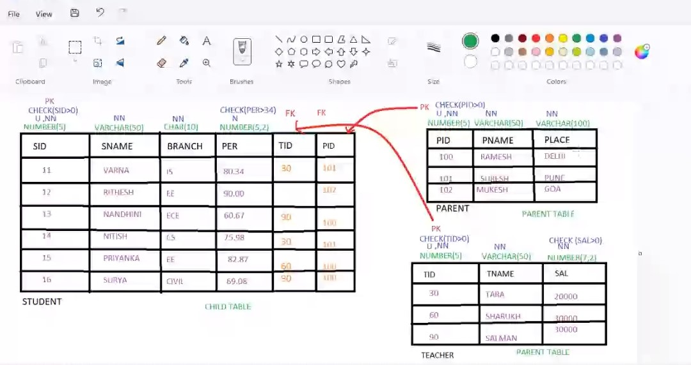

---

## 06/02/2023
# `Overveiw of SQL:-`

###  1) Data Definition Language(DDL)
  ```sql
    - Create 
    - Rename
    - Alter
    - Truncate
    - Drop
  ```
###  2) Data Manipulation Language(DML)
    - Insert
    - Update
    - Delete
###  3) Transaction Controlled Langugage
    - Commit 
    - Rollback
    - Savepoint
###  4) Data Controlled Language
    - Grant 
    - Revoke
###  5) Data Querry Langugage
    - Select
  
  * Projection
  * Selection
  * Joins
---
#### `Important questions`
```diff
-
-  1. what is data?
-  2. what is database?
-  3. what are CRUD and operations? give an example.
-  4. what is DBMS and RDBMS and tell the difference.
-  5. Tell the alternative name for Rows, Coumns.
-  6. Definition for Rows, Cell and Table
-  7. who invented Relational Model.
-  8. Rules of E.F. Codd
-  9. Explain Datatypes and tell the Difference between Var and Varchar.
-  10. Explain constraints and tell the difference between Primary key and Foregin key
-  11. Another name for foregin key.
-
---
```

## Data Query language (DQL):-
  - It i a language in which we can get/fetch the data from already created table.  
  - types of statements: 
  
  ###  Projection
  - projection is used to fetch the data by selecting only columns.
  - Syntax:-      
    ```sql
      SELECT*/[DISTINCT],COL_NAME,EXPRESSION/[ALIAS]FROM TABLE_NAME;
    ```    
  - arguments written in [] square braces are optional
  - there are 5 arguments in above example. 
  - 3 are mandatory and 2 are not mandatory. 
####  ORDER OF EXECUTION:
    1) FROM CLAUSE
    2) SELECT CLAUSE
      - we have to specify SELECT clause first then FROM clasuse. 
      - but form clause will be excecuted first.
  #### working proceduure of projection img:
  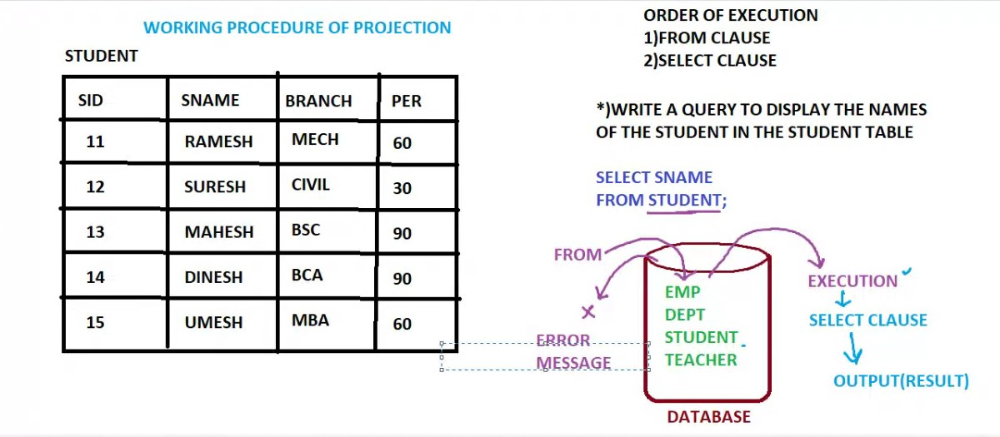

  ### working procedure of projection:
    - first FROM clause will starts the execution and search for the given table.
    - if the table is present in the database it will be kept under execution.
    - if the table is not present in  the database, it will be throwing you an eror message.
    - after the execution of FROM clause, SELECT clause will starts the execution and gives you the output.


### SELECT clasuse :-
  - the job of select clasuse is to display the result and it is also responsible ffor the result table.
### Semicolon(;) :-
  - it is used to end the statement or Query.
### Seperator(,) :-
  - it is used to wrtite the Multiple column names or Multiple argumentsub the SELECT clause.

---

## Example:
#### Question. WAQTD (Write a query to display) name and branch of students.
  -  SELECT SNAME,BRANCH FROM STUDENT;   
  - **Answer:**  

  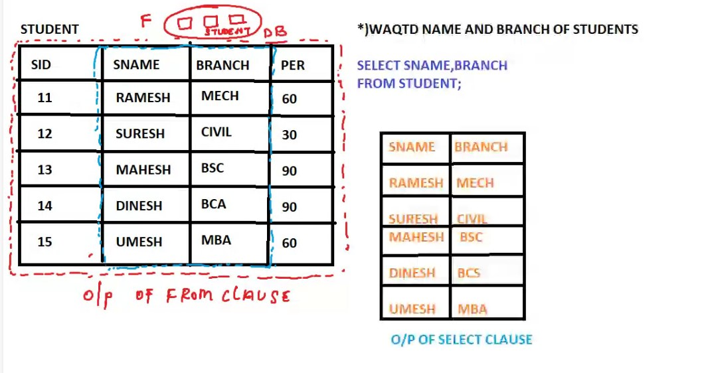   
  
---

## ***03/02/2023***

### Distinct Clause :-  
  - Distinct clause is used to remove the duplicate values in the result.
  - Distinct clause has to be passed as the first argument in the select clasuse.
  - In distinct clasuse we can pass multiple column_names and it will remove the combination of columns which are repeated.

  ####  Note:-
    - Distinct clause will remove all the duplicate records only if all the column values are same.

  ##### `example 1:-`    
  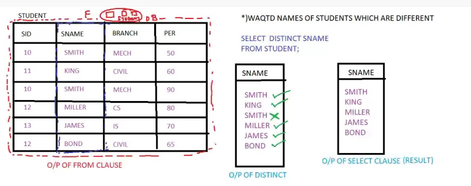
  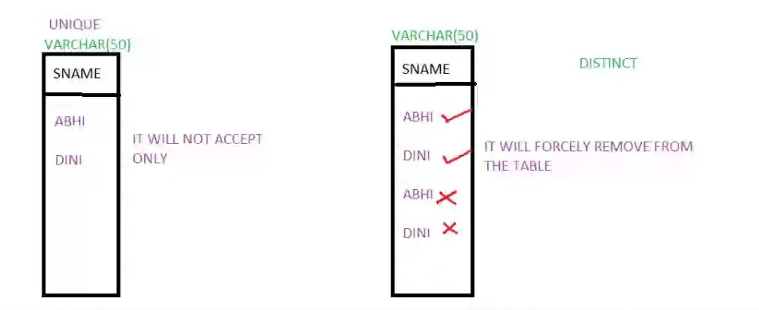

  ##### `example 2:-`     

  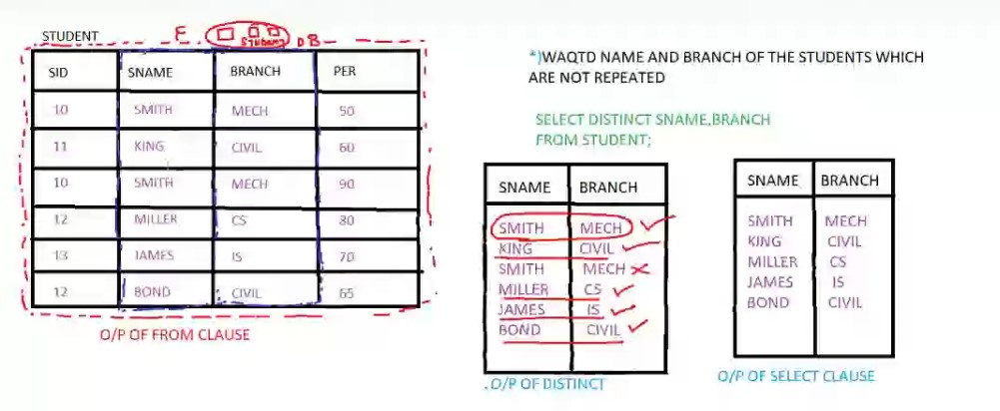
  ##### `example 3:-`
  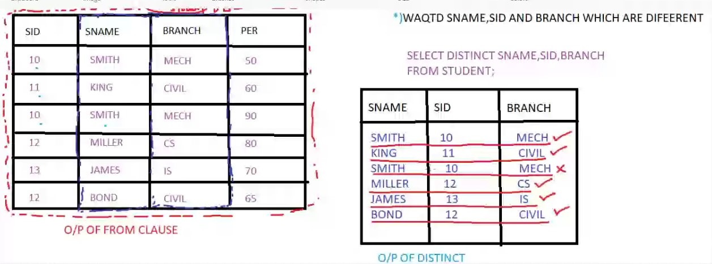


##  ***COMMANDS***

1.  
  ```sql
    SELECT * FROM TAB;
  ```
    - This command is used to get all the table names from the database.    
  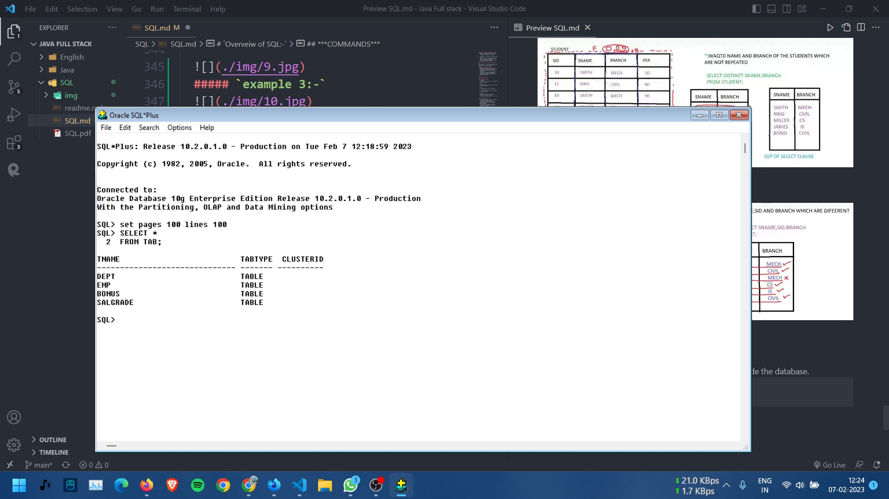

2)  
  ```sql
      SET LINES 1000 PAGES 100;
  ```
    - it is used to ellaborate the page length and lines of the software.   

3)  Slash   

  ```sql
      /
  ```
    - it is used to get the previous output.
  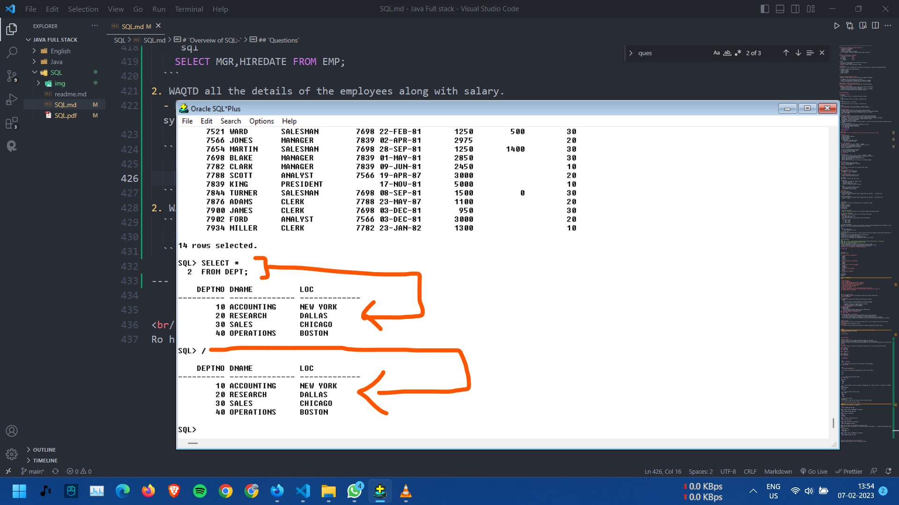      
  
4)  EDIT (ED)
  ```sql
      EDIT;
      OR 
      ED;
  ```
    - it is used to modify or alter the query in notepad page, you  should not enter (;) semicolon in notepad page.    
  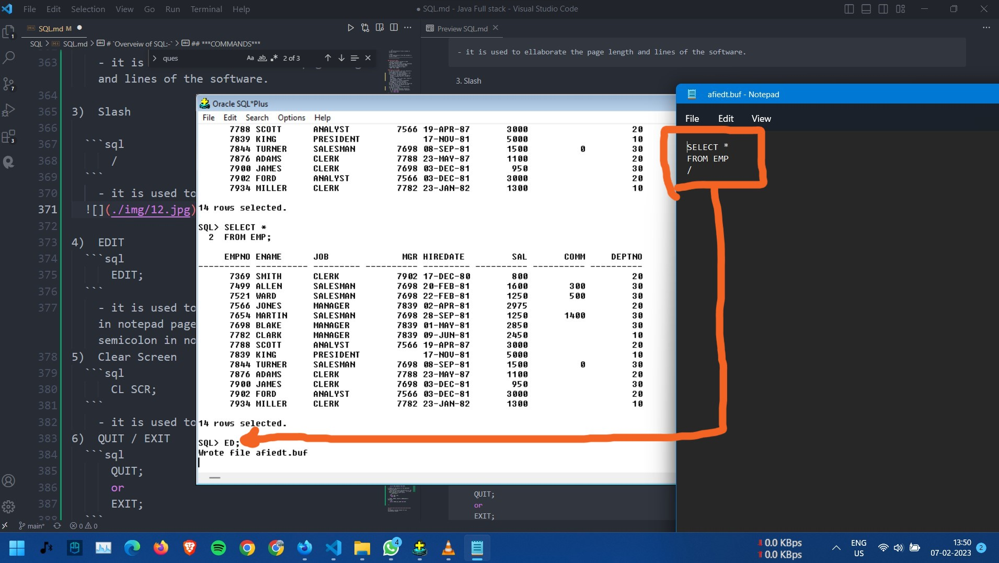
5)  Clear Screen  
  ```sql
      CL SCR;
  ```
    - it is used to clear the whole screen.
6)  QUIT / EXIT  
  ```sql
      QUIT;
      or
      EXIT;
  ```
    - to close the software.
7)  ASTERISK (*)
  - it is used to fetch all the columns & records inside the table.
    or
  - it is used to fetcth the entire table.

## `Questions`   
1.  WAQTD name and designation of employees.

  ```sql
      SELECT ENAME,JOB FROM EMP;
  ```
2. WAQTD  EMPNO, SALARY & COMMISSION of employees.
  ```sql
    SELECT EMPNO,SAL,COMM FROM EMP;
  ```
3. WAQTD details of employees.
  ```sql
    SELECT *
    FROM EMP;
  ```
4. WAQTD  location in department table.
  ```sql
    SELECT LOC FROM DEPT;
  ```
5. WAQTD  MGR& JOINING DATE of employees.
  ```sql
    SELECT MGR,HIREDATE FROM EMP;
  ```
6. WAQTD all the details of the employees along with salary.
  - Here before & after the Asterisk (*), you should not pass any arguments... for using other arguments we have syntax:   
    ```Table_name.*```   
  ```sql
    SELECT EMP.*,SAL
      FROM EMP;
  ```
---

##  Expressions
  - expression is a combination of Operands and Operator.
or 
  - expression is a statement whcih gives you the result.<br/><br/>   
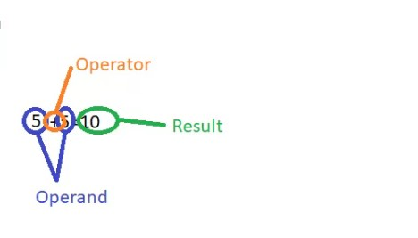

---

### Questions
1.  WAQTD name, salary and also annual salary of employees.
```sql
  SELECT ENAME, SAL, SAL*12 FROM EMP;
```  
2.  WAQTD name, salary, salary with the hike of 10%.
```sql
  SELECT ENAME, SAL, SAL+SAL*10/100 FROM EMP;
```
3.  WAQTD name, salary, salary with the deduction of 10%
```sql
  SELECT ENAME, SAL, SAL-SAL*10/100 FROM EMP;
```
4.  WAQTD all the details of the employees with 15% hike in salary.
```sql
  SELECT EMP.*, SAL+SAL*10/100 FROM EMP;
``` 
5.  WAWTD all the details of employees with the deduction of 15% in salary.
```sql
  SELECT EMP.*, SAL-SAL*15/100 FROM EMP;  
```
6.  WAQTD all the names, salary of employees with the hike of 10% in annual salary.
```sql
  SELECT ENAME, SAL, SAL*12+SAL*12*10/100 FROM EMP;
```
7.  WAQTD all the names, salary of employees along with the deduction of 10% in annual salary.
```sql
  SELECT ENAME, SAL, SAL*12-SAL*12/100 FROM EMP;
```
8.  WAQTD names, salary and also half term salary.

```sql
  SELECT ENAME, SAL, SAL*6, FROM EMP;
```  
9.  WAQTD names, salary and also per day salary of eomployees.
```sql
  SELECT ENAME, SAL, SAL*12/365 FROM EMP;
            OR
  SELECT ENAME, SAL, SAL/30 FROM EMP;
```
10. WAWTD name, salary, annual salary and also annual bonus of Rs. 2000.
```sql
  SELECT ENAME, SAL, SAL*12, SAL*12+2000 FROM EMP;
```


<br/><br/><br/><br/><br/><br/><br/><br/><br/><br/>
Ro helpmate (youtube channel for sql installation issues)